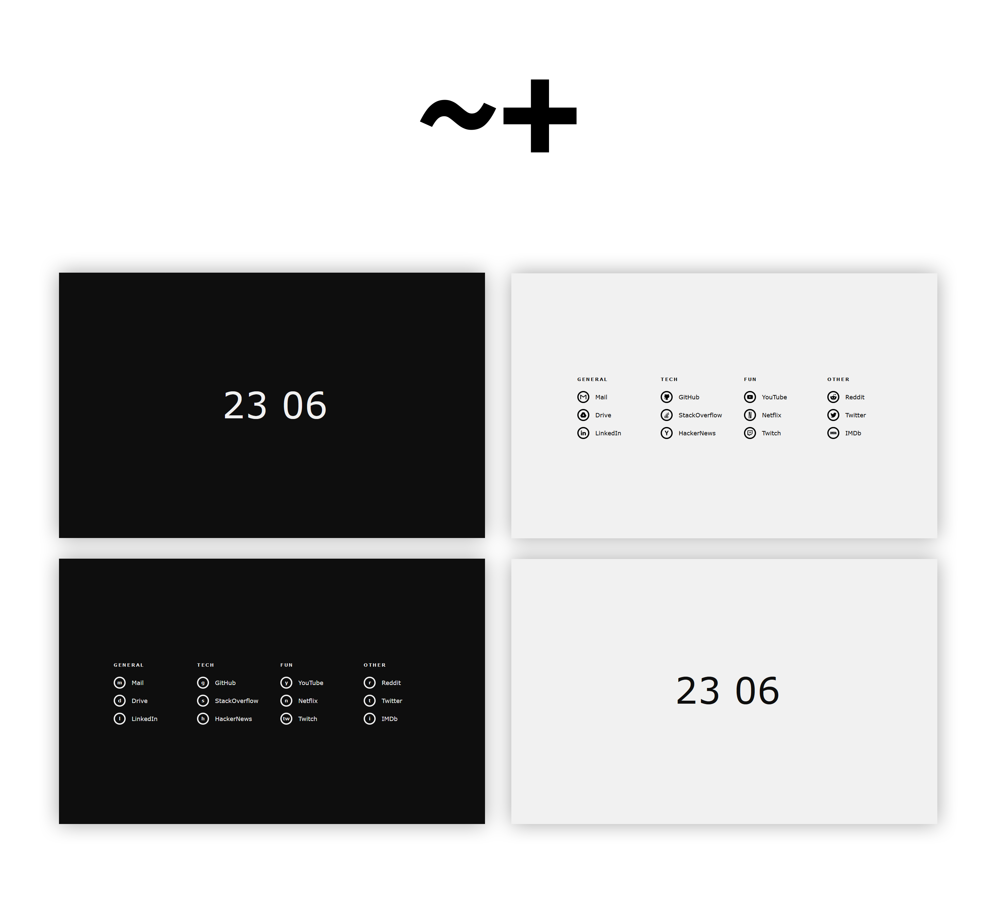

<div align="center">

# 🚀 GhoshCode Startup Page

**A beautiful, minimal, keyboard-driven developer startpage with glassmorphism UI — no frameworks, no build step.**

[](LICENSE)


*Just open `index.html`. That's it.*

</div>

---



---

## 📋 Table of Contents

- [✨ Features](#features)
- [⚡ Quick Start](#quick-start)
- [⌨️ Keyboard Shortcuts](#keyboard-shortcuts)
- [🎨 Customisation](#customisation)
  - [Theme & Wallpaper Widget](#theme--wallpaper-widget)
  - [Configuration](#configuration)
  - [Adding Sites & Icons](#adding-sites--icons)
- [📁 Project Structure](#project-structure)
- [📝 License](#license)

---

## ✨ Features

- ⌨️ **Keyboard-first navigation** — type a shortcut key to jump directly to any site.
- 🔍 **Smart search** — DuckDuckGo autocomplete + typed command history.
- 🎨 **Glassmorphism UI** — sleek, translucent category panels that blur your wallpaper.
- 🌙☀️ **Dark / Light theme** — toggle in one click, persists across sessions via `localStorage`.
- 🖼️ **Wallpaper System** — choose from built-in wallpapers or **upload your own** directly from the widget (stored safely locally).
- 🗑️ **Delete wallpapers** — with inline confirmation, right in the picker panel.
- 🚀 **Quick-launch** — open all starred sites at once with `Space`.
- 📱 **Responsive Grid** — perfect icon alignment and scaling at any screen size or zoom level.

---

## ⚡ Quick Start

No installation. No build. No dependencies.

```bash
git clone https://github.com/YOUR_USERNAME/CustomBrowserStartupPage.git
```

Then open `index.html` directly in your browser:

```bash
# Windows
start index.html

# macOS / Linux
open index.html
```

### Set as New Tab Page

Use a browser extension to point your New Tab to the file path:

| Browser | Extension |
|---|---|
| Chrome | [Custom New Tab URL](https://chrome.google.com/webstore/detail/custom-new-tab-url/mmjbdbjnoablegbcapnhobbgbbbmlpcj) |
| Firefox | [New Tab Override](https://addons.mozilla.org/en-US/firefox/addon/new-tab-override/) |

Set the URL to your local absolute path, e.g.:
```
file:///C:/Path/To/Cool%20Startup%20Page/index.html
```

---

## ⌨️ Keyboard Shortcuts

### How It Works

| Input | Result |
|---|---|
| `g` | Navigate to GitHub |
| `g:react signals` | Search GitHub for "react signals" |
| `g/torvalds` | Go to `github.com/torvalds` |
| `anything else` | Falls back to Google search |
| `Space` / `!` | Open help panel (shows all links) |
| `!1` | Quick-launch all sites in category 1 |
| `Escape` | Close the help panel |

> Prefix a search with a space (` query`) to force Google instead of a command match.

---

## 🎨 Customisation

### Theme & Wallpaper Widget

A subtle widget sits in the **bottom-right corner** of the page.

| Control | Action |
|---|---|
| **🌙 / ☀️ button** | Toggle dark / light theme |
| **🖼️ button** (hover) | Open wallpaper picker panel |
| **Thumbnail click** | Apply that wallpaper instantly |
| **×** on thumbnail (hover) | Shows inline delete confirmation for custom wallpapers |
| **＋ dashed tile** | Upload a local image to use as your wallpaper |

> **Uploads** are stored as base64 strings in `localStorage` — no server needed. They persist between refreshes but are tied to your browser profile.

### Adding More Built-in Wallpapers

1. Drop an image into `assets/wallpapers/`
2. Register it in `js/themeSwitcher.js`:

```js
const BUILTIN_WALLPAPERS = [
  { id: 'none', label: 'None',    src: null },
  { id: 'w1',   label: 'Image 1', src: 'assets/wallpapers/Image1.jpg' },
  { id: 'w4',   label: 'My Wall', src: 'assets/wallpapers/mywall.jpg' }, // ← add here
];
```

### Configuration

Everything is configured in **[`js/config.js`](js/config.js)** — no other files need touching.

| Option | Default | Description |
|---|---|---|
| `suggestions` | `true` | Enable search suggestions |
| `suggestionsLimit` | `4` | Max suggestions shown |
| `instantRedirect` | `false` | Redirect on first key match immediately |
| `newTab` | `false` | Open links in a new tab |
| `colors` | `true` | Coloured overlay when a command is matched |
| `showKeys` | `false` | Show key labels instead of icons |
| `searchDelimiter` | `:` | Separator between key and search query |
| `pathDelimiter` | `/` | Separator between key and sub-path |
| `twentyFourHourClock` | `true` | 24h vs 12h clock format |

### Adding Sites & Icons

In `js/config.js`, add an entry to the `commands` array:

```js
{
  category: 'Programming',   // Section heading (e.g., 'General' or 'Programming')
  name: 'My Site',           // Display label
  key: 'ms',                 // Keyboard shortcut
  url: 'https://mysite.com', // Base URL
  search: '/search?q={}',    // Optional — {} is replaced by your query
  color: '#0066CC',          // Accent colour for the search overlay
  icon: 'mysite.svg',        // File in assets/icons/ (SVG or PNG)
  quickLaunch: false,        // true = opens on Space/! press
}
```

1. Get a clean SVG from [SimpleIcons](https://simpleicons.org/) or use a PNG.
2. Place it in `assets/icons/`
3. Reference it in your command: `icon: 'mysite.svg'`

> **Note:** Because the category panels feature a dark glassmorphism background in *both* Light and Dark themes, your icons sit inside white border rings and are never color-inverted. Use **white SVGs** or **brightly colored PNGs** for best visibility!

---

## 📁 Project Structure

```text
Cool Startup Page/
├── index.html                  # Entry point
├── css/
│   └── style.css               # CSS Grid, Glassmorphism & Themes
├── js/
│   ├── config.js               # ⚙️ Main config — edit your links here!
│   ├── help.js                 # Link panel renderer
│   ├── themeSwitcher.js        # Theme + wallpaper upload widget
│   ├── body.js                 # Background colour logic
│   ├── clock.js                # Live clock
│   ├── form.js                 # Search form
│   ├── index.js                # App bootstrap
│   ├── influencers.js          # Suggestion sources
│   ├── queryParser.js          # Shortcut parser
│   └── suggester.js            # Autocomplete engine
└── assets/
    ├── fonts/                  # Metropolis (woff2)
    ├── icons/                  # Site icons (PNG + SVG)
    └── wallpapers/             # Background images
```

---

## 📝 License

[MIT](LICENSE) — fork, modify, and make it yours.

---

<div align="center">

*"There's no place like 127.0.0.1"*

**Built by [Ghosh](https://github.com/YOUR_USERNAME)**

</div>
